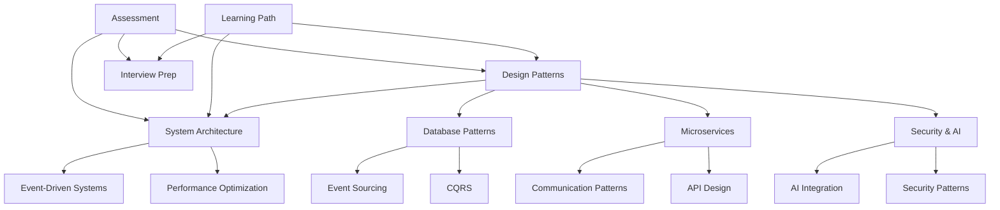

# Comprehensive System Design Framework Mapping

## 🎯 Overview

This document provides a detailed mapping of how all files in this repository interconnect to form a comprehensive system design and learning framework. The repository contains implementations, documentation, and guides that cover everything from fundamental design patterns to advanced AI integration patterns.

## 🏗️ Framework Architecture

### Core Learning Pillars

```
┌─────────────────────────────────────────────────────────────────────────┐
│                    COMPREHENSIVE SYSTEM DESIGN FRAMEWORK                │
├─────────────────┬─────────────────┬─────────────────┬─────────────────┤
│  FUNDAMENTALS   │   PATTERNS      │  ARCHITECTURE   │   ADVANCED      │
│                 │                 │                 │                 │
│ • Core Concepts │ • Design        │ • System        │ • AI/LLM        │
│ • Basic Patterns│   Patterns      │   Architecture  │   Integration   │
│ • Best Practices│ • Implementation│ • Microservices │ • Security      │
│ • Learning Path │ • Code Examples │ • Event-Driven │ • Performance   │
└─────────────────┴─────────────────┴─────────────────┴─────────────────┘
```

## 📊 File Interconnection Matrix

### 1. **Core Design Patterns Layer**

#### 1.1 Pattern Implementations (Root Directory)
- `SingletonExample.java` → Event store management, circuit breaker registry
- `FactoryExample.java` → Service creation, command handler creation
- `ObserverExample.java` → Event-driven systems, AI event monitoring
- `StrategyExample.java` → AI provider selection, pricing algorithms
- `StateExample.java` → Conversation management, message states
- `ChainOfResponsibilityExample.java` → Request processing, content moderation
- `CircuitBreakerExample.java` → Service resilience, failure handling

**Interconnections:**
- All patterns connect to `Design_Patterns_Implementation_Summary.md`
- Referenced in `Java_Design_Patterns_For_System_Architecture.md`
- Applied in AI integration patterns in `Security_Patterns/AI_LLM_Integration_Patterns.md`

#### 1.2 Advanced Pattern Implementations (`Advanced_Patterns/`)
- `AdapterExample.java` → Legacy system integration
- `BuilderExample.java` → Complex object construction, AI request building
- `CommandExample.java` → CQRS implementation, AI command processing
- `DecoratorExample.java` → Feature enhancement, AI response decoration
- `FlyweightExample.java` → Memory optimization, model caching
- `MementoExample.java` → State management, conversation history
- `PrototypeExample.java` → Object cloning, configuration templates

### 2. **Architectural Documentation Layer**

#### 2.1 System Architecture (`SD/Architecture/`)
- `Microservices_Architecture.md` ↔ `Microservices_Patterns/Core_Patterns.md`
- `Event_Driven_Architecture.md` ↔ `Real_Time_Systems/Event_Streaming_Architecture.md`
- `Hexagonal_Architecture.md` → Clean architecture principles
- `CQRS_Architecture.md` ↔ `Database_Patterns/Advanced_Database_Patterns.md`

#### 2.2 System Design Patterns (`SD/Patterns/`)
- `Circuit_Breaker_Pattern.md` ↔ `CircuitBreakerExample.java`
- `Saga_Pattern.md` ↔ Distributed transaction patterns
- `Event_Sourcing_Pattern.md` ↔ Database event sourcing implementations
- `Bulkhead_Pattern.md` → Resource isolation patterns

### 3. **Database and Data Management Layer**

#### 3.1 Database Patterns
- `Database_Patterns/Design_Patterns.md` → Fundamental database patterns
- `Database_Patterns/Advanced_Database_Patterns.md` → Advanced patterns (sharding, CQRS, event sourcing)
- `SD/Patterns/Database_Design_Patterns.md` → Pattern implementations

**Key Interconnections:**
- Event sourcing patterns → `ObserverExample.java` and AI event tracking
- CQRS patterns → `CommandExample.java` and AI command processing
- Polyglot persistence → Microservices data strategies

### 4. **Microservices and Communication Layer**

#### 4.1 Microservices Patterns
- `Microservices_Patterns/Core_Patterns.md` → Fundamental microservices patterns
- `Microservices_Patterns/Communication_Patterns.md` → Service communication strategies

**Cross-References:**
- API Gateway patterns ↔ `API_Design/Advanced_API_Design_Patterns.md`
- Circuit breaker ↔ `CircuitBreakerExample.java`
- Event-driven communication ↔ `ObserverExample.java`
- Saga pattern ↔ `SD/Patterns/Saga_Pattern.md`

### 5. **API Design and Integration Layer**

#### 5.1 API Design Patterns
- `API_Design/Advanced_API_Design_Patterns.md` → RESTful design, GraphQL
- `API_Design/REST_Best_Practices.md` → REST implementation guidelines
- `API_Design/GraphQL_Implementation.java` → GraphQL code examples

**Connections:**
- Links to microservices communication patterns
- Supports AI/LLM API integration patterns
- Referenced in security best practices

### 6. **Security and AI Integration Layer**

#### 6.1 Security Patterns
- `Security_Patterns/Security_Best_Practices.md` → Core security patterns + AI security
- `Security_Patterns/AI_LLM_Integration_Patterns.md` → Comprehensive AI integration patterns
- `Security_Patterns/AI_Chatbot_Implementation_Guide.md` → Strategic implementation guide
- `Security_Patterns/AIAssistantArchitectureExample.java` → Practical implementation

**AI Integration Cross-References:**
- Uses `ChainOfResponsibilityExample.java` for request processing
- Implements `ObserverExample.java` for AI event monitoring
- Applies `StrategyExample.java` for AI provider selection
- Leverages `StateExample.java` for conversation management

### 7. **Real-Time and Event Systems Layer**

#### 7.1 Event-Driven Systems
- `Real_Time_Systems/Event_Streaming_Architecture.md` → Event streaming patterns
- `Real_Time_Systems/Streaming_Architecture.md` → Real-time processing
- `Event_Driven_Architecture/EventSourcingExample.java` → Event sourcing implementation

**Interconnections:**
- Event patterns ↔ `ObserverExample.java`
- Streaming ↔ AI real-time processing patterns
- Event sourcing ↔ Database advanced patterns

### 8. **Performance and Monitoring Layer**

#### 8.1 Performance Patterns
- `Performance_Optimization/Performance_Strategies.md` → Optimization techniques
- `Performance_Optimization/Advanced_Caching_Strategies.md` → Caching patterns
- `Performance_Optimization/LoadBalancerExample.java` → Load balancing implementation

#### 8.2 Monitoring Systems
- `Monitoring_Systems/AdvancedMonitoringExample.java` → Monitoring implementation
- Links to AI monitoring patterns in security section

### 9. **Learning and Assessment Layer**

#### 9.1 Learning Framework
- `docs/learning-path.md` → Structured learning progression
- `docs/interview-guide.md` → Interview preparation
- `Assessment/Interactive_Challenges.md` → Practical challenges
- `Assessment/README.md` → Assessment overview

#### 9.2 Interview Preparation
- `Interview_Prep/` → Comprehensive interview materials
  - `Java_DSA/` → Data structures and algorithms
  - `SpringBoot/` → Framework-specific knowledge
  - `Cloud_Services/` → Cloud platform knowledge
  - `Coding_Challenges/` → Programming challenges

## 🔗 Key Integration Patterns

### Pattern-to-Architecture Mapping

| Design Pattern | System Architecture | Real-World Application | AI Integration |
|----------------|--------------------|-----------------------|----------------|
| **Singleton** | Service Registry | Configuration Manager | Model Instance Management |
| **Factory** | Service Creation | Command Handler Factory | AI Provider Factory |
| **Observer** | Event-Driven Architecture | Event Broadcasting | AI Event Monitoring |
| **Strategy** | Algorithm Selection | Pricing Strategies | AI Model Selection |
| **State** | State Management | Message States | Conversation Management |
| **Chain of Responsibility** | Request Processing | Content Moderation | AI Request Pipeline |
| **Circuit Breaker** | Service Resilience | Failure Handling | AI Service Protection |
| **Command** | CQRS | Action Execution | AI Command Processing |
| **Builder** | Complex Construction | Configuration Building | AI Request Building |

### Cross-File Dependencies



## 🎓 Learning Progression Framework

### Phase 1: Fundamentals (Weeks 1-4)
**Files to Study:**
1. `docs/learning-path.md` (Modules 1-2)
2. Core pattern examples (`SingletonExample.java`, `FactoryExample.java`, etc.)
3. `Design_Patterns_Implementation_Summary.md`
4. `System_Design_Principles/SOLID_Principles.md`

**Outcomes:** Understanding basic patterns and principles

### Phase 2: System Architecture (Weeks 5-8)
**Files to Study:**
1. `docs/learning-path.md` (Modules 3-4)
2. `SD/Architecture/` directory
3. `Database_Patterns/Design_Patterns.md`
4. `Microservices_Patterns/Core_Patterns.md`

**Outcomes:** Architectural thinking and system design

### Phase 3: Advanced Patterns (Weeks 9-12)
**Files to Study:**
1. `docs/learning-path.md` (Modules 5-6)
2. `Advanced_Patterns/` directory
3. `Database_Patterns/Advanced_Database_Patterns.md`
4. `Microservices_Patterns/Communication_Patterns.md`

**Outcomes:** Complex system design and implementation

### Phase 4: Specialization (Weeks 13-16)
**Files to Study:**
1. `Security_Patterns/AI_LLM_Integration_Patterns.md`
2. `Real_Time_Systems/` directory
3. `Performance_Optimization/` directory
4. `Container_Orchestration/` and `Distributed_Systems/`

**Outcomes:** Specialized knowledge in AI, performance, and distributed systems

### Phase 5: Integration and Assessment (Weeks 17-20)
**Files to Study:**
1. `Assessment/Interactive_Challenges.md`
2. `Interview_Prep/` complete directory
3. `docs/interview-guide.md`
4. All practical examples and implementations

**Outcomes:** Interview readiness and practical application

## 🚀 Practical Implementation Flow

### 1. **Basic Pattern Implementation**
Start with root-level Java files → Understand basic patterns → Apply to simple scenarios

### 2. **Advanced Pattern Application**
Move to `Advanced_Patterns/` → Implement complex scenarios → Integrate multiple patterns

### 3. **Architectural Implementation**
Use `SD/Architecture/` guides → Design complete systems → Apply patterns at scale

### 4. **AI Integration**
Study `Security_Patterns/AI_*` files → Implement AI chatbots → Apply security patterns

### 5. **Production Readiness**
Implement monitoring, performance optimization → Add security layers → Deploy and scale

## 📈 Assessment and Validation Framework

### Knowledge Validation Matrix

| Topic | Basic Level | Intermediate Level | Advanced Level | Expert Level |
|-------|-------------|-------------------|----------------|--------------|
| **Design Patterns** | Implement basic patterns | Combine multiple patterns | Create pattern libraries | Design new patterns |
| **System Architecture** | Design simple systems | Create microservices | Design distributed systems | Architect at scale |
| **Database Design** | Basic CRUD operations | Advanced queries | Distributed databases | Performance optimization |
| **AI Integration** | Basic AI APIs | Secure AI systems | Scalable AI platforms | AI architecture design |
| **Security** | Basic authentication | Advanced security | Security architecture | Security strategy |

### Assessment Files Usage
- `Assessment/Interactive_Challenges.md` → Hands-on challenges
- `Interview_Prep/Coding_Challenges/` → Technical problem-solving
- `docs/interview-guide.md` → Interview simulation
- All Java examples → Code review and improvement

## 🔧 Tools and Scripts Integration

### Development Tools
- `Tools/system_design_toolkit.py` → System design utilities
- `SD/Scripts/` → Various simulation and testing scripts
- `create_and_run_task` configurations → Build and test automation

### Testing Framework
- Pattern validation through Java compilation and execution
- Architecture validation through documentation review
- AI integration testing through practical implementation

## 🌟 Conclusion

This repository forms a complete system design learning and implementation framework through:

1. **Layered Learning**: From basic patterns to advanced AI integration
2. **Practical Implementation**: Working code examples for every concept
3. **Real-World Applications**: Netflix, Uber, WhatsApp case studies
4. **Modern Integration**: AI/LLM patterns and security considerations
5. **Assessment Framework**: Challenges, interview prep, and validation tools

Every file serves a specific purpose in the learning journey, with clear interconnections and progression paths. The framework supports both academic learning and practical implementation, making it suitable for students, professionals, and teams looking to master modern system design patterns and AI integration.

## 📚 Quick Reference Guide

### For Beginners
Start with: `docs/learning-path.md` → Basic pattern examples → `Design_Patterns_Implementation_Summary.md`

### For Developers
Focus on: Java implementations → Advanced patterns → Microservices patterns → AI integration

### For Architects
Emphasize: System architecture docs → Advanced database patterns → Performance optimization → Security patterns

### For AI Engineers
Concentrate on: `Security_Patterns/AI_*` files → Event-driven patterns → Real-time systems → Performance optimization

### For Interview Preparation
Use: `docs/interview-guide.md` → `Interview_Prep/` directory → Assessment challenges → All pattern implementations
